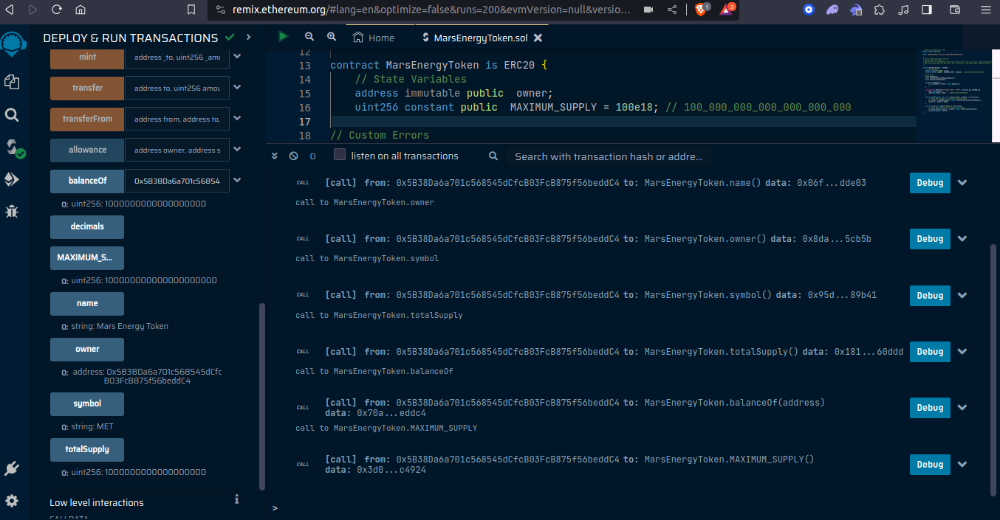
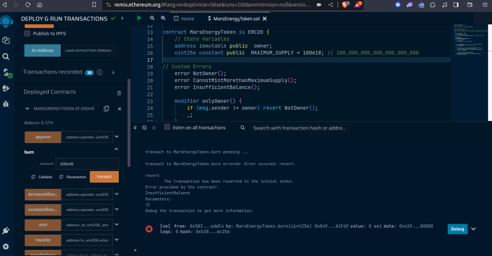
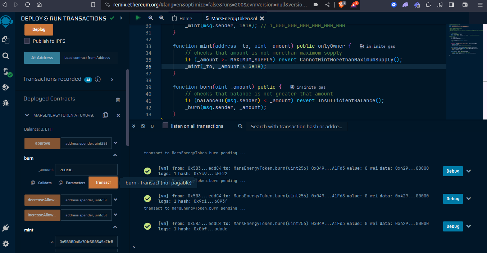
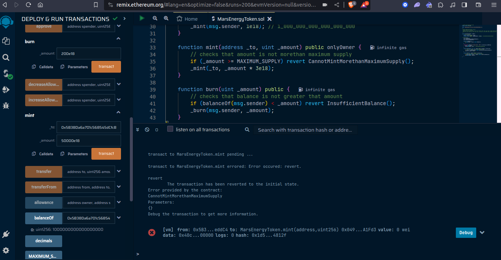
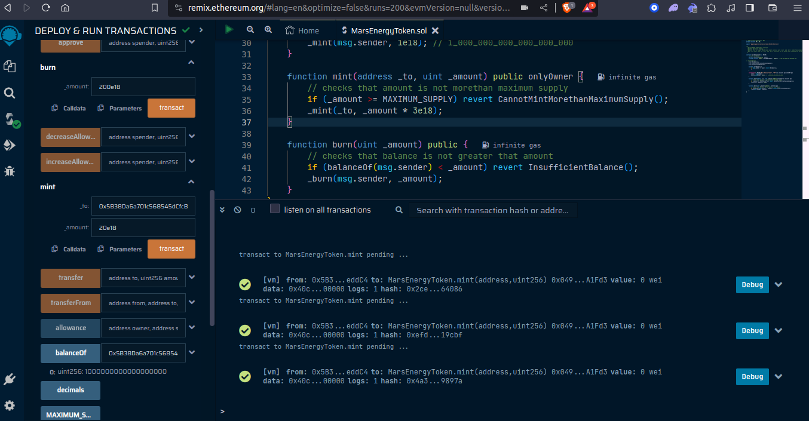
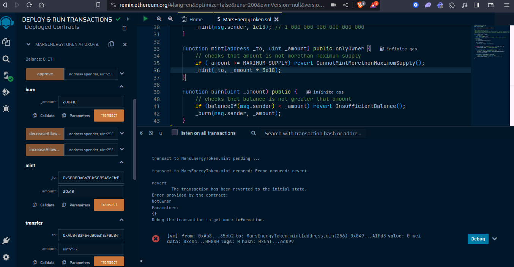
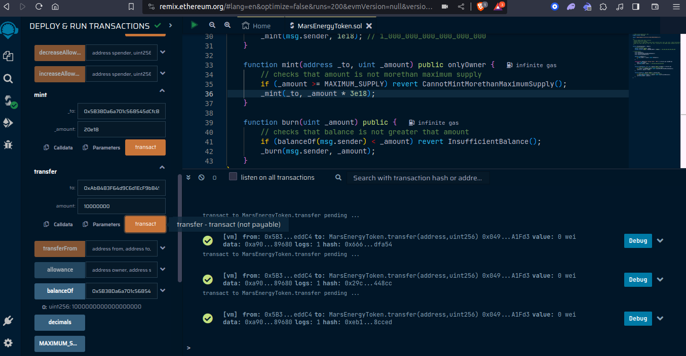

# Mars Energy Token (ERC20-Token)

## Overview

This is simple ERC20 token smart contract that uses the [OpenZeppelin Contract library](https://www.openzeppelin.com/contracts) with an added `mint` and `burn` token functionalities.

## Table of Contents

- [Mars Energy Token (ERC20-Token)](#mars-energy-token-erc20-token)
  - [Overview](#overview)
  - [Table of Contents](#table-of-contents)
    - [Token Information](#token-information)
    - [Functions](#functions)
    - [Contract Interactions](#contract-interactions)
    - [Demo Video](#demo-video)
    - [Deploying and Testing on Remix](#deploying-and-testing-on-remix)
  - [Authors](#authors)
  - [License](#license)

### Token Information

- **Name:** Mars Energy Token
- **Symbol:** MET
- **Maximum Supply:** 100e18

### Functions

`Constructor` Initializes the ERC-20 token with the specified name and symbol.

- Sets the contract deployer as the owner.
- Mints and InitialSupply of `1e18` to the owner.

`mint(address \_to, uint \_amount)`,allows only the owner of the contract to mint new tokens.

- Checks to ensure that amount is not more than `MAXIMUM_SUPPLY`and then
- Mints new tokens and assigns them to the specified address.

`burn(uint \_amount)`, allows users to burn their token

- Checks to ensures that the caller has a sufficient balance to burn.
- Burns a specified amount of tokens from the caller's balance.

### Contract Interactions

- The contract owner can mint new tokens using the `mint` function.
- Any address can burn their tokens using the `burn` function, provided they have a sufficient balance.

### Demo Video

https://www.loom.com/share/327239bb903646afb3b7156650613f2f?sid=ec3d36b6-cc85-4211-a790-19a3358b3af7

### Deploying and Testing on Remix

- Deploying Contract and checking all the initial States

- 

- Trying to `burn` an `amount` more then the Initial Supply or Balance. reverts with the custom error `InsufficientBalance()`

- 

- Burning an `amount` less than Balance. Transactions Successful

- 

- Trying to `mint` an amount greater than `MAXIMUM SUPPLY`, reverts with the custom error `CannotMintMorethanMaximumSupply()`

- 

- Minting `amounts` less than `MAXIMUM_SUPPLY`. Transactions Successful

- 

- Trying to `mint` from an account that is not the owner of the contract, reverts with the custom error, `NotOwner()`

- 

- Transferring token `amounts` from the owner to another address

-
- 

## Authors

Marcellus Ifeanyi
[@metacraftersio](https://twitter.com/Mars_Energy)

## License

This project is licensed under the MIT License - see the LICENSE.md file for details.
